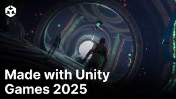

# Unity Design - Week 01

## Agenda

1. [Intro To Unity](#Intro-to-Unity)  
2. [Installing Unity Hub](#installing-unity-hub)  
3. [Unity Essentials](#installing-unity-editor-62)  
4. [Unity Asset Store](#managing-unity-modules)  
5. [Unity Build and Publish ](#creating-a-new-unity-project)  
6. [Installing GitHub Desktop](#adding-existing-projects-to-unity-hub)  
7. [Git LFS](#additional-resources)
8. [Git Readme Formatting](#additional-resources)
9. [Class Assignment - Week #01](#additional-resources)

---

## 🚀 Intro to Unity

Unity is a cross-platform real-time development platform primarily known for its game engine, enabling the creation of 2D and 3D interactive experiences, including video games, simulations, and augmented/virtual reality applications.

---

- **Unity Sizzle Reels**:  
[](https://www.youtube.com/watch?v=LlgHCeLV92Y)
[](https://www.youtube.com/watch?v=MtTea5GZHmo)

---

## 🚀 Install Unity Hub + Unity 6.2

## Requirements

- **Operating System**:  
  - **Windows**: 10 (64-bit) or 11  
  - **macOS**: macOS X 11+  
  - **Linux**: Ubuntu 24.04 supported (RPM/Deb installations possible for other distributions) :contentReference[oaicite:0]{index=0}

- **System compatibility**: Ensure your machine can run Unity. If your PC or Mac is relatively recent (within the last few years), you're likely good to go :contentReference[oaicite:1]{index=1}.

---

## Installing Unity Hub

1. **Download Unity Hub**  
   Visit the [Unity Download page](https://unity.com/download) and select the installer for your OS :contentReference[oaicite:2]{index=2}.

2. **Run the installer** and follow the on-screen instructions.

3. **Launch Unity Hub** and sign in with your Unity ID (or create one if you don't have an account) :contentReference[oaicite:3]{index=3}.

4. **Keep Unity Hub updated**—Unity Learn tutorials recommend using the latest official (non-beta) release to avoid discrepancies :contentReference[oaicite:4]{index=4}.

---

## Installing Unity Editor 6.2

1. In Unity Hub, go to the **Installs** tab.

2. Click **Add** to view available Unity Editor versions.

3. Select **Unity 6.2 (Supported)** and install it :contentReference[oaicite:5]{index=5}.

   > **Note:** Unity 6.2 is a Supported Update release, offering the latest features and platform improvements with support approximately matching LTS until the next update :contentReference[oaicite:6]{index=6}.

4. Optionally, include additional modules during installation (e.g., for WebGL, Visual Studio, language packs, or documentation) by selecting them in the module list :contentReference[oaicite:7]{index=7}.

---

## Managing Unity Modules

After installing Unity 6.2:

1. In the **Installs** tab, locate the Unity 6.2 entry and click the **gear icon**.

2. Choose **Add Modules**.

3. Select desired components such as **Dev tools**, **Build support** (Windows, WebGL, macOS, etc.), **Documentation**, or language packs, then click **Install** :contentReference[oaicite:8]{index=8}.

---

## Creating a New Unity Project

1. Go to the **Projects** tab in Unity Hub.

2. Click **New Project**.

3. Choose **Unity 6.2** from the **Editor Version** dropdown.

4. Pick a project **template** (e.g., 3D URP, Basic, etc.) :contentReference[oaicite:9]{index=9}.

5. Set a project **name**, **location**, select an **organization**, and decide if you want **Unity Cloud** or **Unity Version Control** enabled :contentReference[oaicite:10]{index=10}.

6. Click **Create project**. Unity Hub will download and open the project in the Editor :contentReference[oaicite:11]{index=11}.

---

## Adding Existing Projects to Unity Hub

To manage an existing project:

1. In Unity Hub’s **Projects** tab, click **Add → Add project from disk**.

2. Navigate to your project folder and select it.

3. If in **Editor Version** you see a warning that Unity 6.2 isn’t installed, either install it or choose another compatible version :contentReference[oaicite:12]{index=12}.

   > **Caution:** Avoid opening a project with an older Unity version—that would be a downgrade :contentReference[oaicite:13]{index=13}.

---

## Additional Resources

- For offline or command-line installations, refer to the official Unity Manual "Install Unity using installer files or Download Assistant" :contentReference[oaicite:14]{index=14}.

- Unity’s [documentation site](https://docs.unity3d.com) and Learn platform have further references for advanced setup and troubleshooting.

- Unity 6.2 includes improvements like Unity AI (beta), enhanced rendering pipelines, platform support, and performance upgrades :contentReference[oaicite:15]{index=15}.

---

## 🚀 Unity Essentials tutorials

### Download Unity Essentials pathway learning modules zip file
[- Unity Essentials Zip File](files/Essentials-Download-U6.zip)

---

## Explore the Editor Interface — Unity Essentials

Welcome to the **Explore the Editor Interface** tutorial from Unity’s "Editor Essentials" series.  
This tutorial helps beginners get familiar with Unity’s core interface: the Project window, Hierarchy, Scene view, Game view, and Inspector.

---

## Tutorial Overview

- **Pathway:** Unity Essentials  
- [Official Tutorial Link](https://learn.unity.com/pathway/unity-essentials/unit/editor-essentials/tutorial/explore-the-editor-interface-1-1?version=6.0)

---

## Step-by-Step Instructions

### 1. Mission Overview
- Learn the purpose of Unity’s main editor windows.  
- Understand how they connect to creating and editing a scene.


---

### 2. Tutorial Overview
- You’ll practice using **Project**, **Hierarchy**, **Scene**, **Game**, and **Inspector** windows.  


---

### 3. Open a Scene from the Project Window
1. In the **Project window**, locate the folder containing your scenes.  
2. Double-click a scene file (e.g., *SampleScene*) to open it.  
  

---

### 4. Explore in the Hierarchy Window
1. Look at the **Hierarchy window** on the left.  
2. Expand objects by clicking the arrows to see how GameObjects are organized.  
3. Try selecting objects to highlight them in the Scene view.  


---

### 5. Move Around in the Scene View
1. Use your mouse to move around:  
   - **Right-click + WASD** = fly mode  
   - **Scroll wheel** = zoom  
   - **Middle mouse drag** = pan  
2. Hold **Alt + Left Click** to orbit around objects.  
  

---

### 6. Use the Pan Tool
1. Select the **Hand Tool** (shortcut: `Q`).  
2. Click-and-drag to move your view within the Scene.  


---

### 7. Enter Play Mode in Game View
1. Click the **Play button** at the top of the Editor.  
2. Observe how the **Game View** simulates the player’s perspective.  
3. Click **Play** again to stop simulation.  
  

---

### 8. Edit GameObjects via the Inspector
1. Select a GameObject in the Hierarchy.  
2. Look at its properties in the **Inspector window**.  
3. Change values (e.g., position, rotation, or scale) to see updates in real-time.  


---

### 9. Save Your Scene
1. Go to **File > Save** (or press `Ctrl+S` / `Cmd+S`).  
2. Confirm the scene is saved in your Project folder.  


---

### 10. Review & Continue
- You explored the five main Unity windows.  
- You can now navigate scenes, adjust objects, and test with Play mode.  
- Next step: continue in the Unity Essentials pathway.  

---

## Master 3D Scene Navigation — Unity Essentials

Welcome to the **Master 3D Scene Navigation** tutorial from Unity’s *Editor Essentials* series.  
This guide teaches you how to navigate 3D space efficiently with key Unity tools in a fun, interactive playground scenario.

---

##  Tutorial Overview

- **Pathway / Unit:** Unity Essentials – Editor Essentials   
- [Official Tutorial Link](https://learn.unity.com/pathway/unity-essentials/unit/editor-essentials/tutorial/master-3d-scene-navigation?version=6.0) :contentReference[oaicite:0]{index=0}

---

## Step-by-Step Instructions

### 1. Overview  
Get an introduction to the tutorial objectives and what you’ll explore next.


---

### 2. Open the Playground Scene  
1. In the **Project window**, locate the *Playground* scene.  
2. Double-click to open it in the Editor.


---

### 3. Frame the Four Playground Areas  
1. Use the **F** key to frame each of the distinct playground areas one at a time.  
2. Identify the different zones as you navigate.


---

### 4. Use Flythrough Mode in the Scene View  
1. Click and hold the **right mouse button** to enter Flythrough mode.  
2. Use **WASD** (forward/back/strafe), **Q/E** (down/up), and hold **Shift** to move faster.  
3. Adjust camera speed with the scroll wheel or trackpad gestures.  
:contentReference[oaicite:1]{index=1}

  
📹 [Flythrough Demo Video](https://youtu.be/your-demo-video-link)

---

### 5. Open the Keyboard Shortcut Reference Sheet  
Access Unity’s keyboard shortcuts to aid navigation and streamline your workflow.


---

### 6. Enter Play Mode and Enter an Incorrect Code  
1. Click **Play** in the Editor toolbar.  
2. Try inputting an intentionally wrong code to progress through the tutorial mechanics.


---

### 7. Use Flythrough Mode to Find the Number on the Swingset  
1. Exit Play mode.  
2. Re-enter Flythrough mode and navigate to the swingset area.  
3. Look for a hidden number and frame it with **F**.


---

### 8. Frame and Zoom to Find the Second Number Inside the Grill  
1. Use **F** to frame.  
2. Scroll or use zoom controls to inspect inside the grill area.


---

### 9. Orbit Around the Play Structure to Find the Third Number  
1. Use the **Orbit tool** (Alt + left-click drag) or the Hand tool (`Q`) to rotate around objects.  
2. Locate the hidden number from different angles.  
:contentReference[oaicite:2]{index=2}


---

### 10. Use the Scene View Gizmos to Reveal the Final Hidden Number  
1. Use the **Scene Gizmo** (upper-right corner of Scene View) to snap to axes or toggle projection.  
2. Reveal and frame the last hidden number.  
:contentReference[oaicite:3]{index=3}


---

### 11. Enter the Correct Code in Play Mode  
1. Click **Play** again.  
2. Enter the **correct code** you discovered to complete the challenge.


---

### 12. Review & Proceed to the Next Tutorial  
Congratulations! You’ve mastered navigating a 3D scene, using Flythrough, framing, orbiting, and the Scene Gizmo.  


---

## Design a Mural in the Scene View — Unity Essentials

Welcome to the **Design a Mural in the Scene View** tutorial, part of Unity’s *Editor Essentials* series.  
You'll learn how to manipulate GameObjects using tools like Move and Rotate while arranging a mural in 3D space.  

---

## Tutorial Overview

- **Pathway / Unit:** Unity Essentials – Editor Essentials  
- [Official Tutorial Link](https://learn.unity.com/pathway/unity-essentials/unit/editor-essentials/tutorial/design-a-mural-in-scene-view?version=6.0)  
:contentReference[oaicite:0]{index=0}

---

## Step-by-Step Instructions

### 1. **Overview**  
Start by understanding the tutorial’s goals: learn to position, rotate, and arrange mural pieces in the Scene view.  


---

### 2. **Get a Top View of the Mural**  
- Use the **Scene Gizmo** to snap the scene camera to a top-down (orthographic) view.  


---

### 3. **Select the Move Tool with Global Coordinates**  
- Choose the **Move tool** from the toolbar and enable *Global* coordinate mode to translate objects along world axes.  


---

### 4. **Move the First Large Piece**  
- Drag the first mural segment along the appropriate axis to place it correctly using the Move tool.  


---

### 5. **Rotate the First Piece**  
- Use the **Rotate tool** to adjust the orientation of the first mural element for proper alignment.  


---

### 6. **Move the Next Piece with Shortcuts**  
- Utilize keyboard shortcuts (like W, A, S, D or arrow keys) to move subsequent pieces quickly and efficiently.  


---

### 7. **Move the Next Piece on a Plane in Isometric View**  
- Switch to isometric/orthographic view and move the next mural piece constrained to a specific plane.  


---

### 8. **Complete Your Mural**  
- Continue positioning and rotating additional pieces until your mural is assembled as intended.  


---

### 9. **Hide the Reference Image**  
- Locate and disable or hide any reference image used for positioning the mural to evaluate your layout cleanly.  


---

### 10. **Save Your Scene**  
- Use **File > Save** (or press `Ctrl+S` / `Cmd+S`) to persist your mural scene setup.  


---

### 11. **Review & Proceed to the Next Tutorial**  
- Reflect on your progress. You've now learned to view from different angles, move and rotate objects using global/local axes, and assemble a complex composition.  


---


## 🚀 Importing Assets from Unity Asset Store

Follow these steps to add assets from the Unity Asset Store into your Unity project.

### Prerequisites
* A Unity project already created/opened
* A Unity account (required for accessing the Asset Store)

### Steps to Import Assets

1. **Open the Unity Editor**

   * Launch your project through **Unity Hub**.

2. **Access the Unity Asset Store**

   * In Unity 2020.1 and newer, the Asset Store is accessed via your **web browser**:

     * Go to [Unity Asset Store](https://assetstore.unity.com/)
     * Log in with your Unity account

3. **Download an Asset**

   * Browse or search for the asset you want.
   * Click **Add to My Assets** (if free or purchased already).
   * Then click **Open in Unity** (this will launch the Unity Editor’s Package Manager).

4. **Import the Asset into Your Project**

   * Inside the Unity Editor, go to **Window > Package Manager**.
   * In the **Package Manager**, switch the dropdown to **My Assets**.
   * Find the asset you added, then click **Download** (if not already downloaded).
   * Once downloaded, click **Import**.
   * Unity will display an **Import Unity Package** dialog where you can review files.
   * Select the files you want, then click **Import**.

5. **Verify the Imported Asset**

   * The asset will appear in your **Project > Assets** folder.
   * You can now drag prefabs, textures, scripts, or models into your scene.

### Tips

* Keep your **project organized** by creating folders like `/Assets/Imported/` or `/Assets/ThirdParty/`.
* Check for **sample scenes** inside the imported asset to see how it works.
* Some assets may require additional setup (see the asset’s documentation).

---

## 🚀 Unity Build and Publish To Web and Desktop
Unity allows publishing projects to both web (via WebGL) and desktop platforms (Windows, macOS, Linux). The process involves configuring build settings and then generating the necessary files.
### Publishing for Desktop (Windows, macOS, Linux):
1. **Switch Platform:**
- In Unity, navigate to File > Build Settings. Select the desired desktop platform (Windows, Mac, or Linux) and click "Switch Platform".
2. **Player Settings:** 
- Configure platform-specific settings in Player Settings. This includes options for resolution, icons, splash images, and other platform-specific preferences.
3. **Build:** 
- In Build Settings, click "Build". Choose a location to save the build. For desktop builds, this typically generates an executable file and a corresponding data folder (e.g., _Data on Windows) which must be kept together for the application to run.
4. **Distribution:** 
- Distribute the executable and its accompanying data folder to users. They can then run the application directly on their respective operating systems.

### Publishing for Web (WebGL):
1. **Switch Platform:**
- In Unity, navigate to File > Build Settings. Select "WebGL" as the target platform and click "Switch Platform".
2. **Player Settings:** 
- Configure WebGL-specific settings in Player Settings (accessible from Build Settings). This includes options for compression, template, and publishing settings.
3. **Build:** 
- In Build Settings, click "Build". Choose a location to save the build output, which will be a folder containing HTML, JavaScript, WebAssembly, and data files.
4. **Distribution:** 
- Upload the contents of the generated build folder to a web server. Ensure the server is configured to serve WebAssembly files with the application/wasm MIME type for optimal performance with streaming compilation.

---

## 🚀 Installing GitHub Desktop

1. **Download GitHub Desktop**  
   - Go to the official site: [desktop.github.com](https://desktop.github.com/).  
   - Download the installer for your operating system (Windows or macOS).

2. **Install GitHub Desktop**  
   - Run the installer and follow the setup prompts.  
   - On macOS, drag the app into your **Applications** folder.  
   - On Windows, the installer will handle everything automatically.

3. **Sign in with GitHub**  
   - Launch GitHub Desktop.  
   - Sign in with your GitHub account (or create one if you don’t have it).  

4. **Configure your preferences**  
   - Go to `File > Options` (Windows) or `GitHub Desktop > Preferences` (macOS).  
   - Set your default editor, shell, and Git identity.  

5. **Clone or create a repository**  
   - Use the `File > Clone Repository` option to bring in an existing repo.  
   - Or `File > New Repository` to start a fresh one.  

---

## 🚀 Installing Git Large File Storage (Git LFS)

[Git LFS](https://docs.github.com/en/repositories/working-with-files/managing-large-files/installing-git-large-file-storage)

---

## 📝 GitHub README Formatting (Markdown Basics)

GitHub uses **Markdown** syntax for README files. Here are the essentials:

````
1. **Headings**  
# H1 Title
## H2 Subtitle
### H3 Section

2. **Text Formatting**
**Bold text**  
*Italic text*  
~~Strikethrough~~  
`Inline code`

3. **Lists**
- Bullet list item
- Another item
  - Sub-item

1. Numbered item
2. Second item

4. **Links**
[GitHub Desktop](https://desktop.github.com/)


[](https://youtu.be/VIDEO_ID)
````

[- Git Hub Formatting Readme Docs ](https://docs.github.com/en/get-started/writing-on-github/getting-started-with-writing-and-formatting-on-github/quickstart-for-writing-on-github)

---

## 🚀 Unity Design - Class Assignment - Week #01

Design a kid's bedroom with a bouncing ball and a tower of collapsing building blocks. Follow the lesson and modify the Unity 3D essentials scene. Add 2 elements from the Unity Store. Upload project files to personal github repository.
[- Learn Unity 3D Essentials](https://learn.unity.com/pathway/unity-essentials/unit/3d-essentials)


